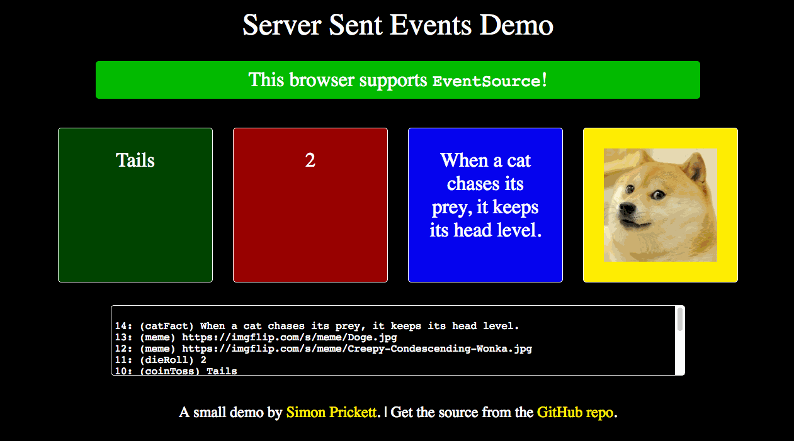

# Server Sent Events Demo

A small Server Sent Events demo for [San Diego JS](http://sandiegojs.org/) Meetup using Node, HTML, JavaScript, CSS.  I also wrote a [post on Medium](https://medium.com/conectric-networks/a-look-at-server-sent-events-54a77f8d6ff7) about this topic.



Slides can be found [here](https://docs.google.com/presentation/d/1ueJ6ewO3i34OXRBI8mY6g26cKbkPDf4cNSrtX4ULBx4/edit?usp=sharing).

## Running this Project

The following instructions assume Mac OS / Linux system with Python installed (to provide a simple web server).

### Get the Code using a Terminal Window

```
git clone https://github.com/simonprickett/server-sent-events-demo.git
cd server-sent-events-demo
```

### Start the Server in a Terminal Window

```
cd src/server
npm install
npm start
```

### Start the Client in another Terminal Window

```
cd src/client
python -m SimpleHTTPServer
```

Then point a browser at `http://localhost:8000/`.

## Reference Materials

* [MDN Server Sent Events Guide](https://developer.mozilla.org/en-US/docs/Web/API/Server-sent_events/Using_server-sent_events)
* [HTML 5 Rocks Tutorial](https://www.html5rocks.com/en/tutorials/eventsource/basics/)
* [O'Reilly High Performance Browser Networking SSE page](https://hpbn.co/server-sent-events-sse/)
* [Data source for cat facts](https://github.com/vadimdemedes/cat-facts)
* Server Sent Events aren't implemented in MS Edge and are currently "under consideration"... read more and vote [here](https://developer.microsoft.com/en-us/microsoft-edge/platform/status/serversenteventseventsource/)
